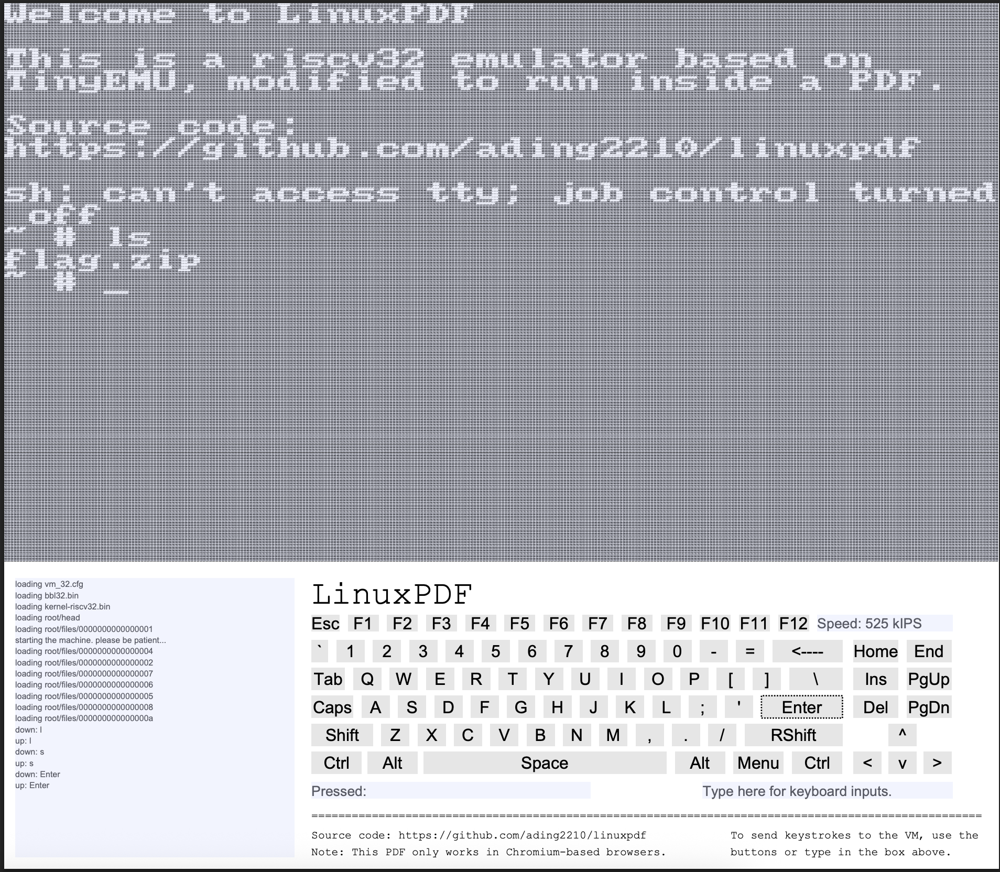
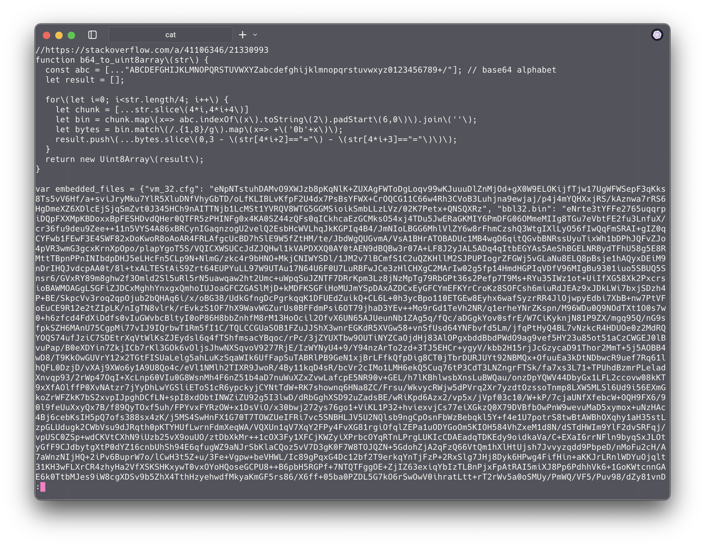
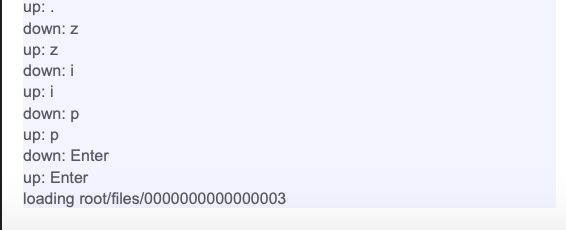

# pd_what

| 📁 Category      | 👨‍💻 Creator | 📝 Writeup By                           |
| ---------------- | ---------- | --------------------------------------- |
| Forensics (Easy) | drgn       | [Vexcited](https://github.com/Vexcited) |

> Here is a fun little PDF I found! I added a flag into it, nothing special, just a good old zip file. But, will you be able to read it in this very limited environment? Open it with a Chromium-based browser like Chrome if you want it to work! I am not the author of the original project.

## Solution

We're given a PDF that actually runs Linux.
Let's see what files do we have here.



Let's try to unzip this!


Oh- encryption is not supported.

### Get `flag.zip` out of here!

What if we'd extract the `flag.zip` to our system directly so we can run `unzip` on this?

After looking at the [LinuxPDF repository](https://github.com/ading2210/linuxpdf/blob/main/embed_files.py), I found out they use a Python script to embed files to the PDF that replaces the content of a JS file dynamically.

```python
js = js_path.read_text()
js = js.replace("__files_data__", json.dumps(files))
```

```javascript
function b64_to_uint8array(str) {
  const abc = [
    ..."ABCDEFGHIJKLMNOPQRSTUVWXYZabcdefghijklmnopqrstuvwxyz0123456789+/",
  ];
  let result = [];

  for (let i = 0; i < str.length / 4; i++) {
    let chunk = [...str.slice(4 * i, 4 * i + 4)];
    let bin = chunk
      .map((x) => abc.indexOf(x).toString(2).padStart(6, 0))
      .join("");
    let bytes = bin.match(/.{1,8}/g).map((x) => +("0b" + x));
    result.push(
      ...bytes.slice(0, 3 - (str[4 * i + 2] == "=") - (str[4 * i + 3] == "="))
    );
  }
  return new Uint8Array(result);
}

var embedded_files = __files_data__; // < this is getting replaced!
for (let filename in embedded_files) {
  embedded_files[filename] = pako.inflate(
    b64_to_uint8array(embedded_files[filename])
  );
}
```

Let's find this part in the PDF: `cat challenge.pdf | less`



Here it is! After extracting the whole embedded files object, we get the following chunks.

```javascript
[
  "vm_32.cfg",
  "bbl32.bin",
  "kernel-riscv32.bin",
  "root/lock",
  "root/head",
  "root/files/0000000000000009",
  "root/files/0000000000000005",
  "root/files/0000000000000008",
  "root/files/0000000000000007",
  "root/files/0000000000000003",
  "root/files/0000000000000006",
  "root/files/0000000000000002",
  "root/files/000000000000000a",
  "root/files/0000000000000001",
  "root/files/0000000000000004",
];
```

In which of them is `flag.zip`? Let's look at the console when running LinuxPDF.



When we ran `unzip flag.zip` it loaded `root/files/0000000000000003` so our `flag.zip` should definitely be in there!

```
eNoL8GZm4WLgZGBguNLtFyUgJvrLGMhWB2IOBhmGtJzEdL2SipLQEE4GZv4j69NBuLSCm4GR5QUzAwOY0PaLqi6NWtiV6Bz96NwL8SkJM6JearDrTOg/N7vuwNGN8zj7r+4/1Cp64jjvfMu1l3gLJiddC/Bm50C2KsCbkUmOGZczJBhAgBGIlzSCWAhHsUIcheagAG9WNogORgY/IN0K1g8A9Io6rg==
```

Let's try to perform the reverse operation to obtain the bytes.

```typescript
import { writeFileSync } from "node:fs";
import pako from "pako";

const file =
  "eNoL8GZm4WLgZGBguNLtFyUgJvrLGMhWB2IOBhmGtJzEdL2SipLQEE4GZv4j69NBuLSCm4GR5QUzAwOY0PaLqi6NWtiV6Bz96NwL8SkJM6JearDrTOg/N7vuwNGN8zj7r+4/1Cp64jjvfMu1l3gLJiddC/Bm50C2KsCbkUmOGZczJBhAgBGIlzSCWAhHsUIcheagAG9WNogORgY/IN0K1g8A9Io6rg==";

function b64_to_uint8array(str: string): Uint8Array {
  const abc = [
    ..."ABCDEFGHIJKLMNOPQRSTUVWXYZabcdefghijklmnopqrstuvwxyz0123456789+/",
  ];
  let result = [];
  for (let i = 0; i < str.length / 4; i++) {
    let chunk = [...str.slice(4 * i, 4 * i + 4)];
    let bin = chunk
      .map((x) => abc.indexOf(x).toString(2).padStart(6, "0"))
      .join("");
    let bytes = bin.match(/.{1,8}/g)!.map((x) => +("0b" + x));
    result.push(
      ...bytes.slice(0, 3 - (str[4 * i + 2] == "=") - (str[4 * i + 3] == "="))
    );
  }
  return new Uint8Array(result);
}

const compressed = b64_to_uint8array(file);
const bytes = pako.inflate(compressed);
writeFileSync("flag.zip", bytes);
```

```sh
$ file flag.zip
flag.zip: Zip archive data, at least v1.0 to extract, compression method=store
```

We now have `flag.zip` on our system!

### Extract `flag.zip`

Sadly, the zip is password protected.

```sh
$ unzip flag.zip
Archive:  flag.zip
[flag.zip] flag.txt password:
```

```sh
$ 7z l -slt ./flag.zip
Listing archive: ./flag.zip

--
Path = ./flag.zip
Type = zip
Physical Size = 233

----------
Path = flag.txt
Folder = -
Size = 39
Packed Size = 51
Modified = 2025-02-15 00:30:39
Created =
Accessed =
Attributes = _ -rw-r--r--
Encrypted = +
Comment =
CRC = FA151610
Method = ZipCrypto Store
Characteristics = UT 0x7875 : Encrypt Descriptor
Host OS = Unix
Version = 10
Volume Index = 0
Offset = 0
```

`flag.zip` contains a `flag.txt` file which is stored using ZipCrypto Store! This is a legacy encryption method, and we can probably crack it using [`bkcrack`](https://github.com/kimci86/bkcrack).

Sadly, we only know the flag format is starting with `drgn{` and this is only 5 bytes, not enough to run `bkcrack`.

Let's run the good ol' [`fcrackzip`](https://manpages.ubuntu.com/manpages/questing/en/man1/fcrackzip.1.html) instead and pray the password is in a popular wordlist.

```sh
$ fcrackzip -u -D -p ~/lists/rockyou.txt ./flag.zip
PASSWORD FOUND!!!!: pw == Braxton78
```

It found a password! Let's try to unzip the zip file with this password.

```sh
$ unzip flag.zip
Archive:  flag.zip
[flag.zip] flag.txt password:
 extracting: flag.txt
$ cat flag.txt
drgn{l1nux_0n_4_pdf??_1'v3_s33n_1t_4ll}
```

Solved!
