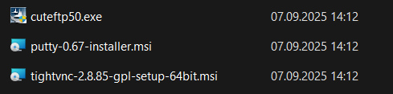
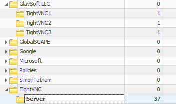
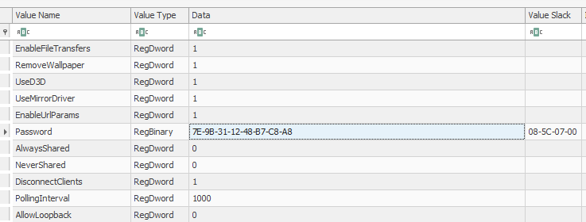
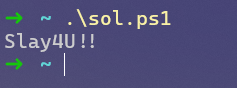

# Obfuscated-1

| 📁 Category  |  👨‍💻 Creator | 📝 Writeup By |
|---------------|-------------|------------|
 Forensics      | Eth007      | darius-it

**Description:**
> I installed every old software known to man... The flag is the VNC password, wrapped in ictf{}.

**Attachment:** [🔗 Users](https://2025.imaginaryctf.org/files/obfuscated-1/Users.zip)

## Solution 
This challenge is a bit more complex than the previous ones, as we are given a ZIP file containing a full Windows user directory, but it was also one of my favorite challenges. The hint in the description tells us that the flag is the VNC password, wrapped in `ictf{}`.

First, we obviously extract the .zip archive and can take a look around the folder structure. What sticks out immediately is the AppData folder, and a `ntuser.dat` file, which is the Windows registry hive for user-specific settings.

I had a look in the AppData folder, but found nothing interesting related to VNC. Before going deeper and looking at the registry, I skimmed the other folders and found some files in the Downloads folder:

Most interestingly, this tells us that the installed VNC software is TightVNC. 

Since there were no other interesting files in any of the other folders, I finally looked into the registry file `ntuser.dat`. For this, I used the tool [Registry Explorer](https://ericzimmerman.github.io/#!index.md), which allows us to open and explore registry hives easily.

After just looking around for a bit, I quickly found some entries related to TightVNC:

The first folder had empty entries that were not relevant, but the second location at `Software\TightVNC\Server` had some interesting entries.

Most notably, there is the `Password` entry, as a hexadecimal value:

This is the VNC password we are looking for! The value is stored as a hex-encoded string, but we cannot simply convert it to ASCII, since VNC passwords are not stored in plaintext. They are obfuscated using a simple algorithm using a fixed key.

I found a [simple Powershell script](https://gist.github.com/jborean93/6168da85e5b3742d943300dd1176a63d) online to decode the key, ran it and got following output:

We can now simply wrap this in the flag format, and we have successfully solved the challenge! 🎉