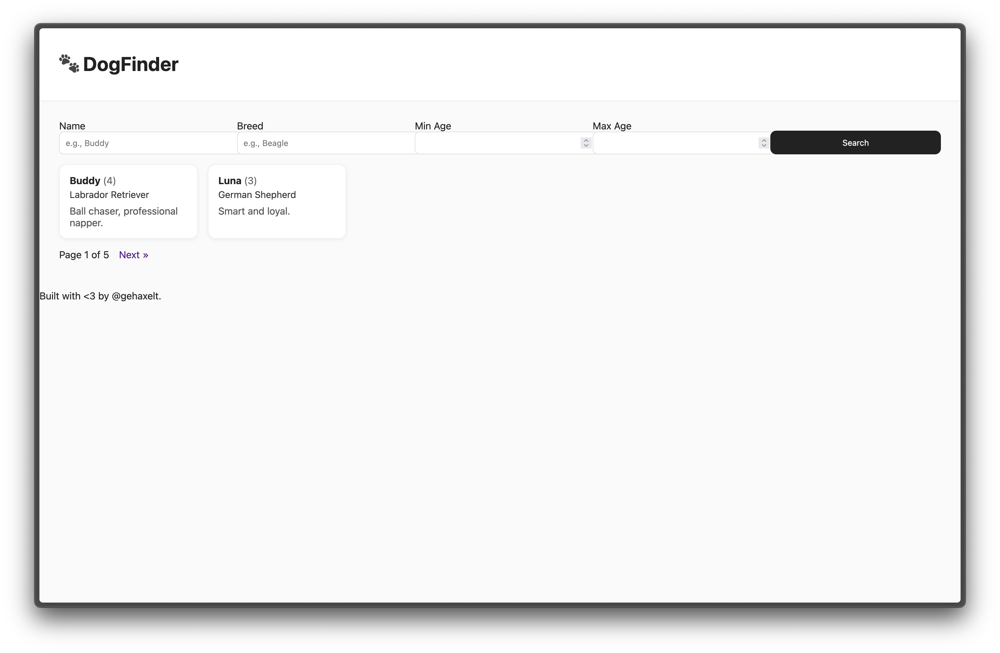

# Dogfinder

| 📁 Category  |  👨‍💻 Creator | 📝 Writeup By |
|--------------|---------------|----------------|
| Web          | Eth007        | darius-it      |

**Description:**
> I like dogs, so I wrote this awesome dogfinder page. Somewhere on the filesystem is a nice treat for you.
>
> http://52.59.124.14:5020 

## Solution
When we open the provided URL, we see a simple web app which displays information about dogs and allows us to filter by name, breed and age.

My first thought was to look for some kind of injection vulnerability, but after trying a few things, I couldn't find anything useful.

First, I tried SQL injection on the URL parameters for name, breed and max/min age, but `sqlmap` yielded no results. Then, me and my teammate Vexcited clicked around the page some more, and found two new parameters, `&page=2` and `&order=id`.

We tried `sqlmap` for SQL injection again, and to our surprise, it worked on the `order` parameter! We could now use `sqlmap` to open a SQL shell on the server using `sqlmap --sql-shell`.

On this shell, we could run commands like `show tables;` to see the tables in the database, and `select * from dogs;` to see the dog entries, but it was unclear how to get the flag from the file system.

We did some digging and found out that PostgreSQL, the database used here, has a function `pg_read_file()` which allows us to read files from the file system, even without needing superuser privileges (we checked privileges beforehand and the current user `dogreader` was not a database admin).

So we ran the command `select pg_read_file('flag.txt');` and got the flag as output! 🎉

`ENO{CuT3_D0GG0S_T0_F1nD_Ev3r1Wh3re_<3}`
