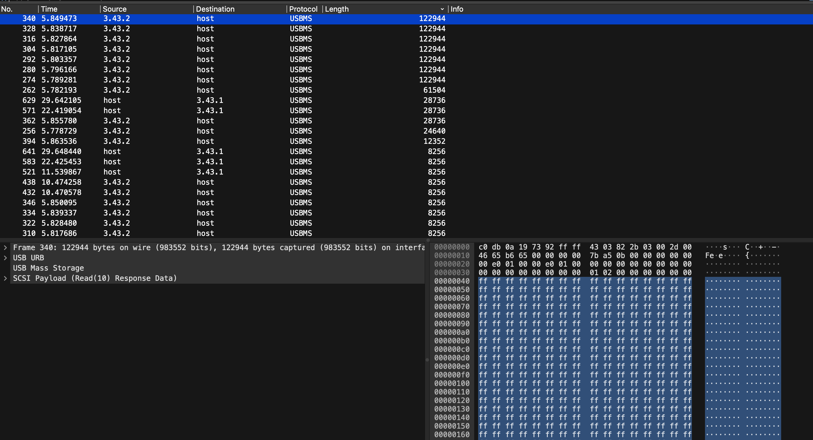
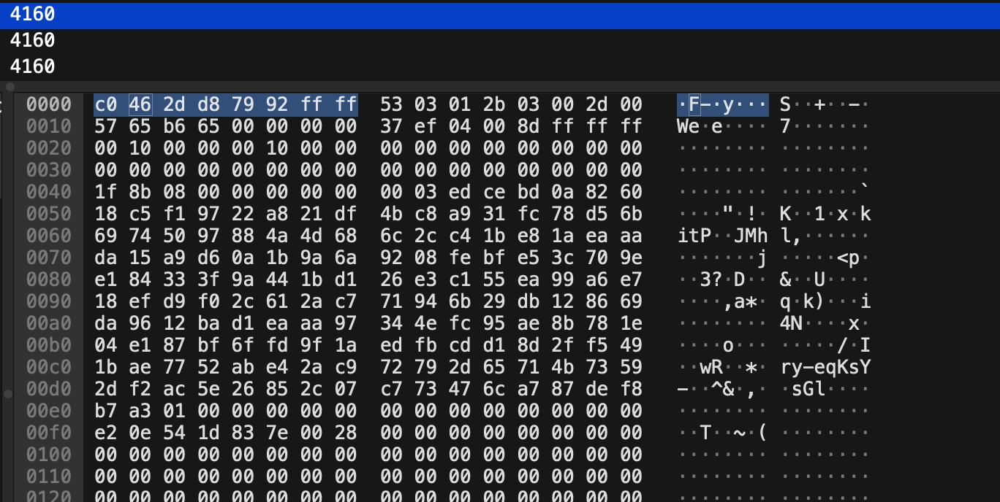

# USB Storage

| 📁 Category  |  👨‍💻 Creator | 📝 Writeup By |
|---------------|-------------|------------|
| Misc          | Eth007      | darius-it |

**Description:**
> I attached my friend's USB drive to my laptop and accidently copied a private file, which I immediately deleted. But my friend still somehow got the file from looking at the USB message their drive recorded...

**Attachment**: [🔗 usbstorage.pcapng.gz](https://ctf.nullcon.net/files/4602b791c636c378e5f49406e4e9e8e5/usbstorage.pcapng.gz?token=eyJ1c2VyX2lkIjozODIwLCJ0ZWFtX2lkIjoxNjc2LCJmaWxlX2lkIjo4OX0.aMMKkA.s2WV15qULFxE1rWhublWPf1EVqo)

## Solution
This challenge provides us with a pcapng file containing USB traffic. The description hints that we are looking for a deleted file that was copied to the USB drive.

First, we can open the pcapng file in Wireshark. I don't really have a lot of experience in Wireshark, so I opened the file and sorted by packet length, hoping to find something interesting.



There were not too many packets which had a large size, so I just skimmed each packed and looked at the content. After a bit of scrolling, one packet stood out as it had a bit more content:



After doing some research, I found out that the header is for a gzip archive (10-byte header). We can simply export the packet bytes to a binary file, and then try to decompress it.

We can paste the hex values into a text file and then convert it to a binary file using `xxd`:

```bash
xxd -r -p usbstorage.hex > usbstorage.tar.gz
```

After that, we can decompress using the tool of our choice (to untar and unzip).

When we are done decompressing, we find the file `flag` containing the flag: 

```
ENO{USB_STORAGE_SHOW_ME_THE_FLAG_PLS}
```

And that's it! We got the flag 🎉
