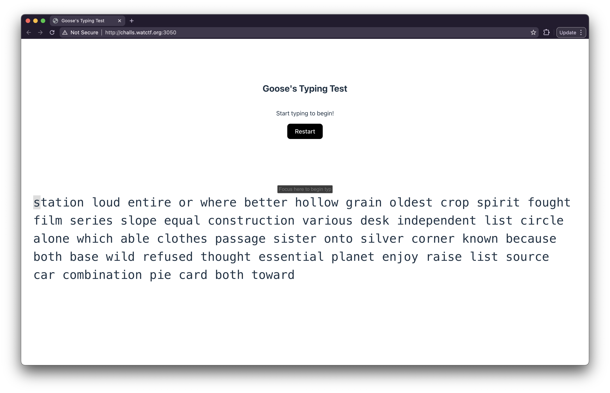
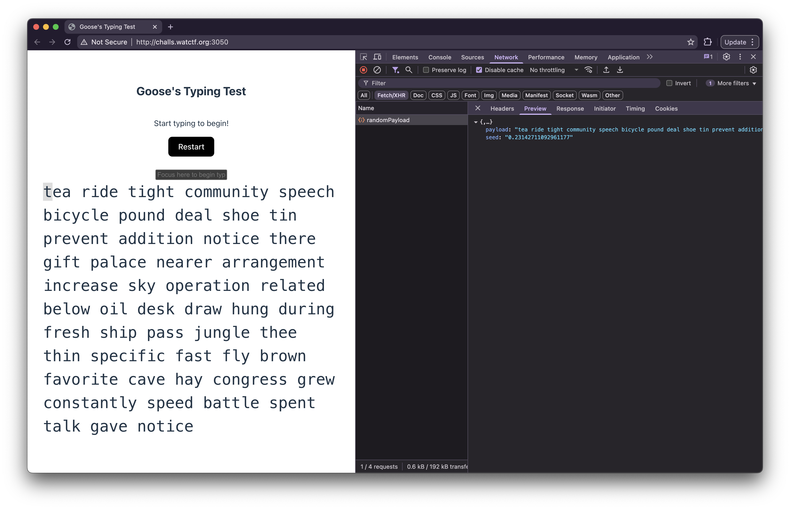
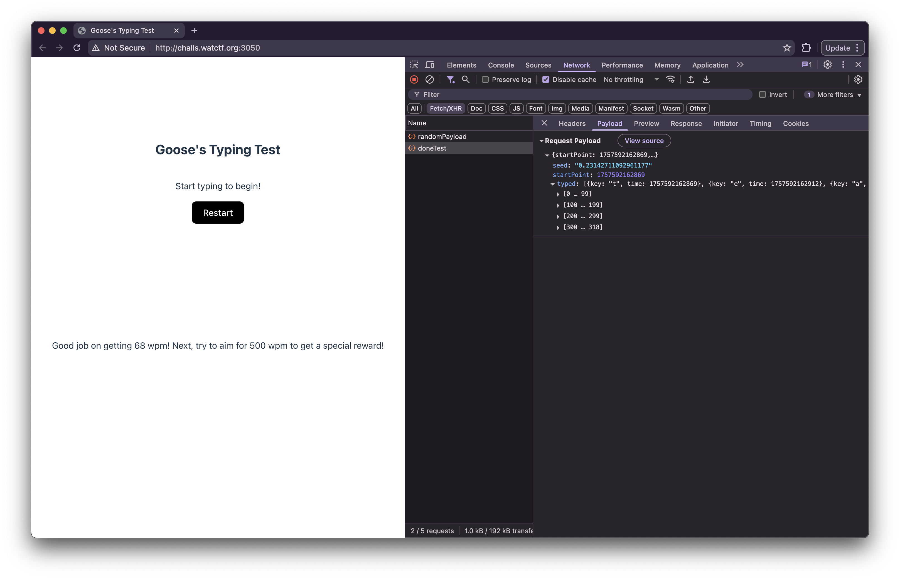

# gooses-typing-test

| 📁 Category | 👨‍💻 Creator                                | 📝 Writeup By                           |
| ----------- | ----------------------------------------- | --------------------------------------- |
| Web         | [virchau13](https://github.com/virchau13) | [Vexcited](https://github.com/Vexcited) |

> Are you a good typer? The Goose challenges you!

## Solution

When we open the challenge, we're in front of a monkeytype-type website where you have to type as fast as possible the random words given to you.



We can open the DevTools and see this first request made on load that gives us the `payload` shown to the screen. There's also the `seed` used to generate these words.



Once we're done with the challenge and submit, there's a second request sent that contains the timestamp where we started typing (`startPoint`), all the characters (`typed`) we typed with the timestamp (`time`) of when we typed that character, and finally, the `seed` received at the beginning.



It tells us that we'll get a special reward once we hit the 500 WPM. Sadly, I wrote at 68 WPM.

I investigated the code (`Sources` tab of the DevTools) to see if there was anything else and found out it was a React app and here's the two `fetch` used to send the requests.

```javascript
fetch(ny + "/randomPayload")
  .then((Q) => Q.json())
  .then((Q) => {
    fl(Q.payload), r(Q.seed);
  });

fetch(ny + "/doneTest", {
  method: "POST",
  body: JSON.stringify({
    startPoint: sl,
    typed: X,
    seed: k,
  }),
  headers: {
    "Content-Type": "application/json",
  },
})
  .then((Q) => Q.json())
  .then((Q) => {
    console.log(Q), E(Q.msg);
  });
```

We have everything we need to build a script!

To make sure we're typing >=500 WPM, I decided to go this path.

```typescript
const now = Date.now();

const typed = chars.map((char, index) => ({
  key: char,
  time: now + index * 10,
}));
```

You can see full the script in [`assets/gooses-typing-test.mts`](./assets/gooses-typing-test.mts).

Running the script with [Bun](https://bun.sh) will give the following output.

```json
{
  "msg": "Wow... you're really fast at typing (898.2035928143713 wpm)! Here's your reward: watctf{this_works_in_more_places_than_youd_think}"
}
```

Here's our flag!

`watctf{this_works_in_more_places_than_youd_think}`
